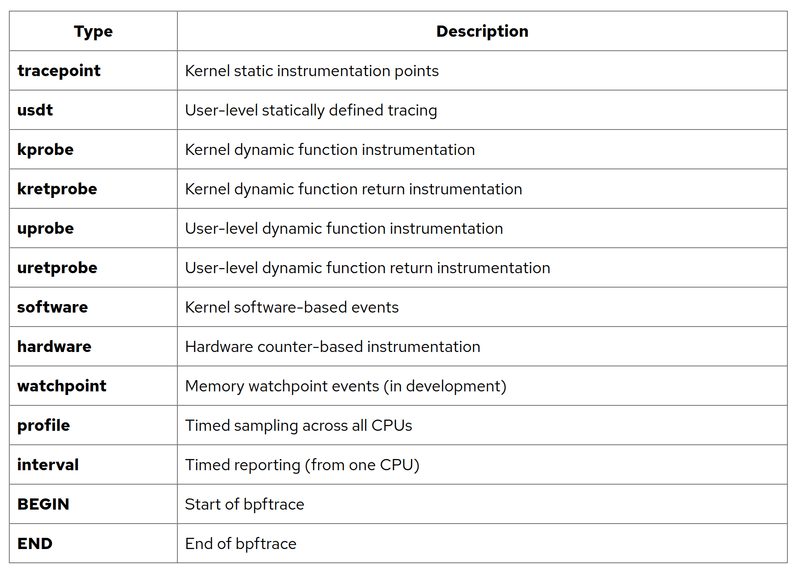
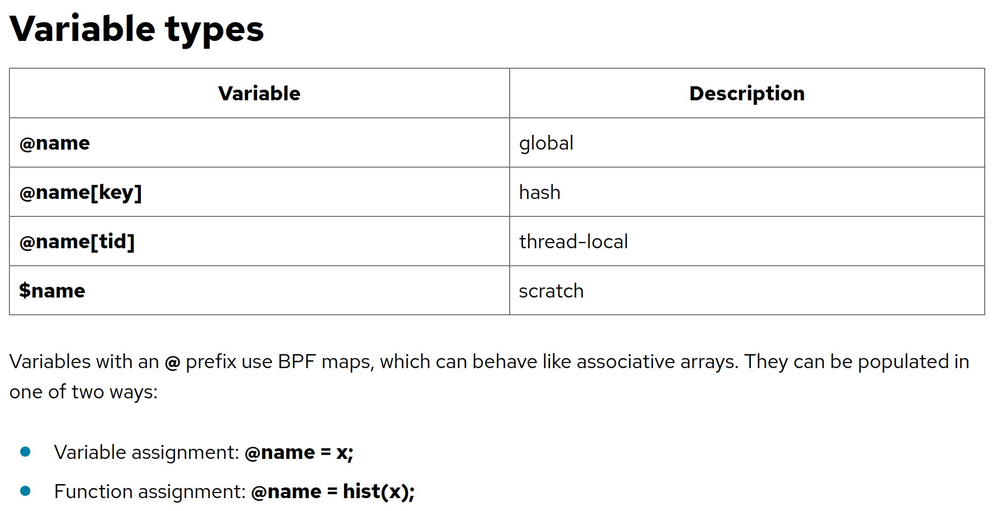
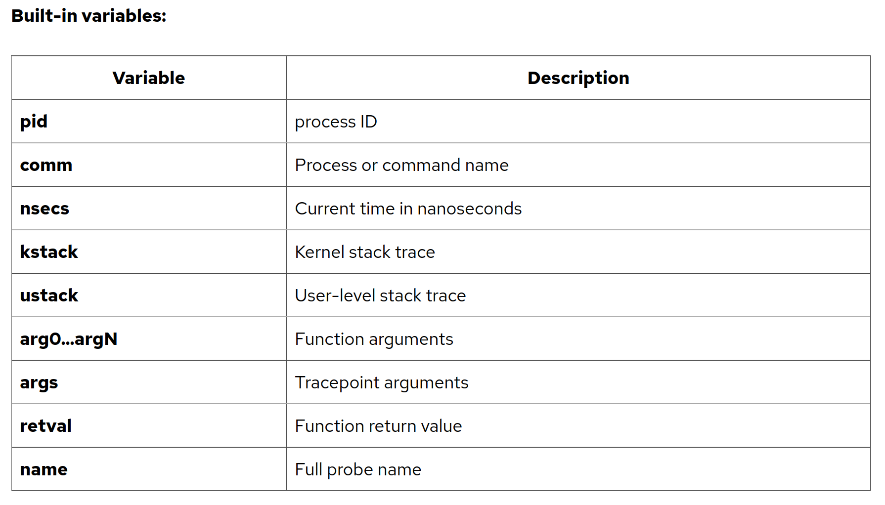
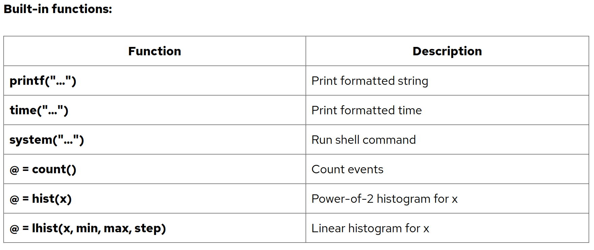

# bpftrace - repo https://github.com/iovisor/bpftrace/tree/master/tools
- basic tutorial: https://opensource.com/article/19/8/introduction-bpftrace
- docs: https://bpftrace.org/docs/release_024/

# Cheetsheet - useful commands
- <span style="color:yellow">VERY IMPORTANTe</span>
, allows to check members of automatically generated tracepoint ```args``` struct: ```bpftrace -vl tracepoint:syscalls:sys_enter_openat```

## What is a PROBE
A probe is a mechanism used to **"trace"** or "instrument" the system. 
It allows you to peer into the kernel or an application to see exactly what’s happening 
in real-time without stopping the program or rebooting the machine

### Kprobes (Kernel Probes)

These are dynamic probes. 
1) You can attach a kprobe to virtually any instruction in the Linux kernel. 
2) When the CPU hits that instruction, it "breaks" execution, runs your custom probe function (to log data or check variables), and then resumes execution.

## Syntax
```probe[,probe,...] /filter/ { action }```
- The probe specifies what events to instrument. 
- The filter is optional and can filter down the events based on a boolean expression
- And the action is the mini-program that runs.


### Simple Example:
```bash
bpftrace -e 'BEGIN { printf("hello world\n"); }'
           **probe**          **action**

# -e ---> Execute PROGRAM instead of reading the program from a file
```
- You use the ```BEGIN``` probe when you need to perform setup tasks before the tracing starts. 
It **triggers exactly once**, immediately after the script is compiled and loaded.

To use bpftrace not inline:
```bash
bpftrace [OPTIONS] FILENAME
# file with .bt extension, see example.bt
```

### More complicated Examples (histogram):
```bash
bpftrace -e 'kretprobe:sys_read /pid == 181/ { @bytes = hist(retval); }'
```
If the PID is 181, a special map variable @bytes is populated with a log2 histogram function with the return value retval of sys_read().

- **kprobes** - attach eBPF programs to **k**ernel function. When that function is called, the **attached eBPF program is triggered at its entry point**, then the original function continues as usual.
- **kretprobe** - are triggered when the **function returns**

### Example using args struct:
```bash
bpftrace -e 'tracepoint:syscalls:sys_enter_openat { printf("%s %s\n", comm, str(args->filename)); }'
```

- It begins with the probe **tracepoint:syscalls:sys_enter_openat**: this is the tracepoint probe type (kernel static tracing), and is instrumenting when the openat() syscall begins (is entered). Tracepoints are preferred over kprobes (kernel dynamic tracing, introduced in lesson 6), since **tracepoints have stable API**.
- To get all available syscalls do: ```bpftrace -l 'tracepoint:syscalls:*'```. Or also you can check directory: ```/sys/kernel/tracing/events/syscalls```
- **comm** is a builtin variable that has the **current process's name**. Other similar builtins include pid and tid.
- **args** is a *struct* containing all the tracepoint arguments. This struct is automatically generated by bpftrace based tracepoint information. The members of this struct can be found with: <br>
!!! 
<span style="color:yellow">**bpftrace -vl tracepoint:syscalls:sys_enter_openat** </span>
!!!.
- **args.filename** accesses the args struct and gets the value of the filename member.
- **str()** turns a pointer into the string it points to.

### Example creating a map
```bash
bpftrace -e 'tracepoint:raw_syscalls:sys_enter { @[comm] = count(); }'

# e.g. output
# @[unattended-upgr]: 5
# @[systemd-logind]: 5
# @[dbus-daemon]: 9
# @[bpftrace]: 52
```
Summarizes syscalls by process name, printing a report on Ctrl-C.

- ```@```: This denotes a special variable type called a **map**, which can store and summarize data in different ways. 
You can add an optional variable name after the @, eg "@num", either to improve readability, or to differentiate between more than one map.
- ```[]```: The optional brackets allow a key to be set for the map, much like an associative array.
- ```count()```: This is a map function – the way it is populated. count() counts the number of times it is called. Since this is saved by comm, the result is a frequency count of system calls by process name.

Maps are automatically printed when bpftrace ends.


## Probe Types



## Variable types



## Built-in Variable types



## Built-in Func types

